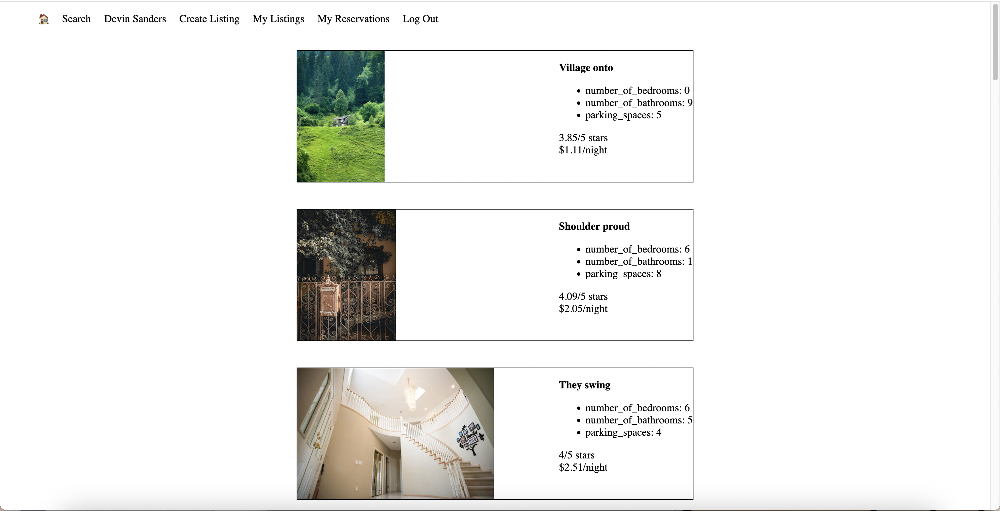
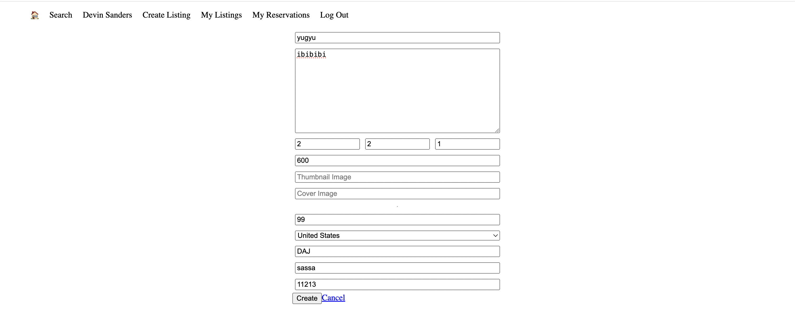

# LightBnB

## Project Summary

LightBNB is an Lighthouse Labs AirBNB clone. It is built using PostgreSQL as relational database system and Express to manage the backend. Users can view properties, rent properties, add properties. They can also search properties by price, location or rating.

## Some functional features
- Search Filters

- Login as existing user

- Become a user with register

- List your property

## ERD 

- **Users**
  - name
  - email
  - password
- **Reservations**
  - start_date
  - end_date
  - property_id
  - guest_id
- **Properties**
  - owner_id
  - title
  - description
  - thumbnail_photo_url
  - cover_photo_url
  - cost_per_night
  - parking_spaces
  - number_of_bathrooms
  - number_of_bedrooms
  - country
  - street
  - city
  - province
  - post_code
  - active
- **Property Reviews**
  - guest_id
  - property_id
  - reservation_id
  - rating
  - message
  

## Setup
  - Start the PostgreSQL server by using the `psql` command in terminal
  - Create the lightbnb db using `CREATE DATABASE lightbnb`
  - Connect to the db using `\c lightbnb`
  - Add tables to the db using `\i migrations/01_schema.sql`
  - Add seed data using `\i seeds/02_seeds.sql`
  - In another terminal, `cd LightBnb_WebApp`
  - Use `npm i` to install dependencies
  - Start the web server using the `npm run local` command. 
  - The app will be served at http://localhost:3000
  => Your app is now ready to be used :smile

